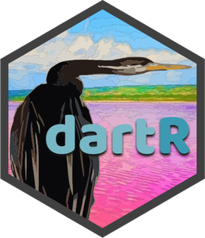

<!-- README.md is generated from README.Rmd. Please edit that file -->

# `dartR.data` <a href="https://green-striped-gecko.github.io/dartR/"></a>

## An accessible genetic analysis platform for conservation, ecology and agriculture - dartR.base

<!-- badges: start -->

### Repositories

| repo | status                                                                                                                                                                                                          |
|------|-----------------------------------------------------------------------------------------------------------------------------------------------------------------------------------------------------------------|
| main | [](https://github.com/green-striped-gecko/dartR.data/actions/workflows/check-standard.yml) |
| dev  | [](https://github.com/green-striped-gecko/dartR.data/actions/workflows/check-standard.yml)   |

Publication:
[](https://doi.org/10.1111/1755-0998.12745)

Zenodo:
[](https://zenodo.org/badge/latestdoi/86640709)

<!-- badges: end -->

## Overview

`dartR.data` stores data used to run examples in dartR.base and other
dartRverse packages.

Currently the dartRverse consists of the following packages:

- dartR.base (report, filter and input/output functions, basic
  popgenomics)
- dartR.data
- dartR.sim (functions to simulate SNP data)
- dartR.spatial (spatial analysis)
- dartR.popgenomics (popgenomics analysis)
- dartR.captive (functions to support analysis around captive breeding)
- dartR.sexlinked

`dartR` and its packages is a collaboration between the University of
Canberra, CSIRO and Diversity Arrays Technology, and is supported with
funding from the ACT Priority Investment Program, CSIRO and the
University of Canberra.

<p align="center">

    
    
    


</p>

## Installation

For a normal install from CRAN use:

``` r
install.packages("dartR.data")
```

For hints and how to install github versions, check the help pages of
the dartRverse package.

## Contribute

If you want to help shape the future of `dartR`, [this
tutorial](http://georges.biomatix.org/storage/app/media/uploaded-files/Tutorial_0_dartR_for_the_Developer_2.0_19-Feb-22.pdf)
is for you.

## Citation

Please acknowledge `dartR` if you use it in your study. Copy and paste
the following code to the R console to retrieve the citation
information:

``` r
citation("dartR.data")
#> 
#> To cite dartR in publications use:
#> 
#>   Gruber, B, Unmack, PJ, Berry, OF, Georges, A. (2018). dartr: An r
#>   package to facilitate analysis of SNP data generated from reduced
#>   representation genome sequencing. Molecular Ecology Resources 18:
#>   691-699. https://doi.org/10.1111/1755-0998.12745
#> 
#>   Mijangos, J. L., Gruber, B., Berry, O., Pacioni, C., & Georges, A.
#>   (2022). dartR v2: An accessible genetic analysis platform for
#>   conservation, ecology and agriculture. Methods in Ecology and
#>   Evolution, (early access). https://doi.org/10.1111/2041-210X.13918
#> 
#> To see these entries in BibTeX format, use 'print(<citation>,
#> bibtex=TRUE)', 'toBibtex(.)', or set
#> 'options(citation.bibtex.max=999)'.
```

Check out our
[articles](https://github.com/green-striped-gecko/dartR/wiki/dartR-team-publications)
and our
[awards](https://github.com/green-striped-gecko/dartR/wiki/dartR-awards).

Have fun working with `dartR`!

Cheers,

Bernd, Arthur, Luis, Carlo & Olly
